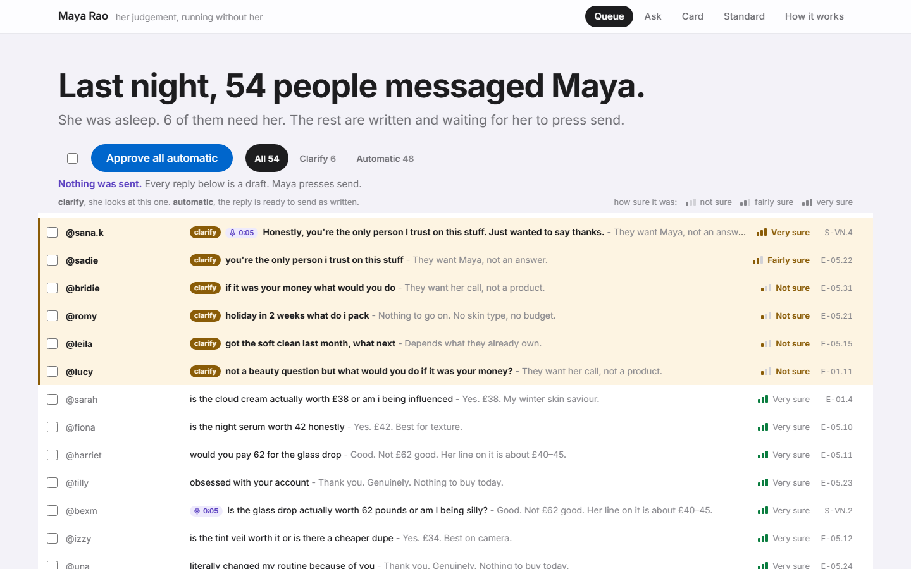

# Maya's judgement, running without her

A creator's taste, recovered from her own public posts as a typed standard, then applied to
messages and products she has never seen. It drafts her replies overnight, refuses on her behalf
when something is out of scope, and re-decides for whoever a card gets forwarded to. **It never
sends. It drafts.**

Built for the **Tano x Corgi Creator Heist Hack**, answering **Case 001, Operation Shade** (Maya
Rao, a skincare creator with 4,800 direct messages a month and no time to answer them).



*`/maya`, the morning inbox. Six of fifty-four need her. Nothing on this screen has been sent.*

---

## Run it

Python 3.12 and Node 20. Two terminals.

```bash
cp .env.example .env          # then put your own keys in it
pip install "fastapi[standard]==0.141.*" "httpx==0.27.2" "python-dotenv==1.0.*" "pillow==12.1.*"

python -m backend.warm        # regenerate the frozen cache. Spends. See the note below
uvicorn backend.main:app --port 8000
```

```bash
cd frontend && npm install && npm run dev      # http://localhost:5173, proxies /api to :8000
```

There is no `requirements.txt`. The four pins above are the ones `api.py` bakes into the Modal
image, so they are the versions this is known to run on.

**`python -m backend.warm` calls the model and costs money.** The cache it writes is already
committed, so you only need it if you have changed the engine. Every route works from that
committed cache with the network off. Adding `?live=1` to any `GET` bypasses the cache and runs
real inference, which also costs money. The default everywhere is the cache.

`modal deploy api.py` puts the whole thing behind one URL. Build the frontend and warm the cache
first, because `api.py` bakes `frontend/dist/` and `cache/` into the image.

---

## The four routes

| Route | What it is | Endpoint behind it |
|---|---|---|
| **`/maya`** | The creator's morning. Last night's messages as a queue: answered, asked back, held for her, referred elsewhere. Every edit she makes writes back a correction | `GET /api/queue` |
| **`/ask`** | The public link in her bio. Three chip taps, no text box. Skin, budget, how many products | `POST /api/ask` |
| **`/c/:id`** | The verdict card and its share image. It re-decides every time it is opened, so forwarding it to a friend mints a child card with a different answer for that friend | `GET /api/card/:id` |
| **`/onboard`** | The front door. Paste a handle, watch fourteen typed slots come out of her public posts next to the captions they came from, get a first verdict | `GET /api/onboard`, `GET /api/extract` |

`/how-it-works` is a fifth route. It plays the whole pipeline as a fifteen-second animation and
exists for the stage, not for a user. `/` redirects to `/maya`.

---

## What is measured, and what is only claimed

This repository retracts its own best finding. Read that section first.

### Measured, reproducible from `scripts/`

| Result | Number | Script |
|---|---|---|
| Her standard recovered through typed slots | **14 slots** a side, **0.65s**. Ten agree with a dermatologist, four disagree | `engine_decontaminated_v2.py` |
| **Held-out test.** Her private routing sheet (case exhibit E-02.2) recovered from public posts alone, never in any prompt | **3 of 3.** DRY to Cloud Cream, OILY to Daily Gel, REDNESS to Red Reset | `engine_decontaminated_v2.py`, grep `HELD_OUT_PRIVATE_ROUTING` |
| Fidelity. Priya, who writes "my face freaks out", gets Red Reset | **5 runs of 5**, unforced | `engine_decontaminated_v2.py` |
| Onboarding extraction | 0.67s, 89% correct against her documented self | `engine_onboarding.py` |
| Message routing | 12 real messages, 0.68s, 12 of 12 routed | `engine_dm_router.py` |
| Overnight queue | 50 messages, 0.85s, 78% handled, 14% referred | `engine_overnight_queue.py` |
| Basket engine | 6 shoppers, 4.8s | `engine_basket.py` |
| Share card | 222 baskets, 2.55s. Four receivers, four different answers | `engine_sharecard.py` |
| Basket stability over 5 repeats | **1.00** | `engine_decontaminated_v2.py` |
| Ranking products alone is largely generic | 85% top-20 overlap with a generic dermatologist, correlation +0.86 | `eval_ab_vs_generic.py` |

### Retired by our own re-measurement

We nearly claimed that Maya sends you away with fewer products and a smaller bill than a
dermatologist would. **She does not.** Asked the same fourteen typed questions, the two standards
return the **identical basket for all eight test shoppers**. Divergence **0 of 8**, difference
**0.00 products**, difference **£0**. Verified over ten full sweeps and four configurations.

| Retired claim | Status |
|---|---|
| "0.7 fewer products, £14 less" | Was authored into Maya's judge state. Dead. |
| "5 of 6 shoppers diverge" | Artefact of hand-written rules on one side only. Dead. |
| "3 of 8 shoppers diverge, 0.2 fewer products, £7 less" | Six-slot under-specification. Ask fourteen questions and it goes to 0 of 8. Dead. |
| "A dermatologist says three products and seventy-two pounds" | Not reproducible. Both judges return the same basket. Dead, and cut from the demo. |
| `skippable_category` as a slot worth quoting | Unstable at 0.60 over five extractions. Off every slide. |

The earlier numbers were under-specification, not a finding. Ask both sides six questions and you
measure your own question set.

### Things that did less than they look like they did

**Her pictures.** Fifteen images from her own posts are read by GPT-4o-mini under a strict schema
and reach the model as typed attributes. They are honest and they are in the payload. They did
**not** move her extracted standard in a way anyone should quote. The claim is that the machine
can see, not that seeing changed the answer.

**Instagram.** A real scraper was written and abandoned. A logged-out profile lookup returned HTTP
429 on the first request from a residential address, and 0 of 6 from cloud addresses that had
never touched the site. Evidence is in `scripts/probe_modal_ip.py`. The corpus path that works is
RSS, fetched by hand before the demo, committed as a file.

### Projected, not measured at that scale

"Seventy hours a month becomes twelve cards a day" is her real volume from the case file, 4,800
messages a month, multiplied by the handled and held rates measured on the 50-message sample. It
is arithmetic on a measured rate, not a run at that scale.

### The one stated caveat

The Priya fidelity result rests on the slot `route_reacting`, which is stable across five
extractions but low confidence at **0.34**. We print the number rather than round it.

Full workings, including an adversarial self-review of everything still in our own handwriting:
**[`docs/11-honest-headline.md`](docs/11-honest-headline.md)**. That file is the source of truth
for every number above.

---

## Architecture

Python 3.12 and FastAPI in `backend/`, no Docker. Every judgement is a typed call to Jev, the
TypeSafe System One model: application state in, a typed verdict and a probability out, with no
prose parsing anywhere. `backend/engine.py` holds the standard, the shelf and the basket search.
`backend/corpora.py` turns a real person's public writing into the state the model judges.
`backend/cache.py` makes every route replayable from disk, which is why the demo survives bad
venue wifi. OpenAI does the seeing and the hearing only, GPT-4o-mini for images and Whisper for
voice notes, and never the deciding. The frontend is Vite, React and TypeScript in `frontend/`.
`api.py` wraps the lot in a single Modal container so the whole thing has one shareable URL.

```
GET  /api/case                      the issued case pack
GET  /api/standard                  her fourteen typed slots
POST /api/standard/override         she corrects a slot
GET  /api/queue                     the overnight queue
POST /api/queue/{qid}/action        approve, edit, hold, refer
POST /api/ask                       a stranger asks, gets a card
GET  /api/card/{id}                 the card, re-decided on open
POST /api/card/{id}/redecide        re-decide for a forwarded reader
GET  /api/card/{id}/og.png          the share image
GET  /api/onboard                   paste a handle, see the standard
GET  /api/creators                  which subjects are real people
GET  /api/extract                   the extraction, replayable
GET  /api/extract/stream            the same, as server-sent events
GET  /api/compare                   two subjects, slot by slot
GET  /api/voice                     the voice notes
GET  /api/health                    cache state and model version
```

The contract is frozen in [`docs/10-API-CONTRACT.md`](docs/10-API-CONTRACT.md). An index of the
rest of the documentation is in [`docs/README.md`](docs/README.md).

---

## Checks

```bash
python scripts/check_contract.py    # every endpoint against the frozen contract
python scripts/voice_lint.py        # the copy, against her documented style
python scripts/voice_lint.py --docs # the same, including docs/ and this file
cd frontend && npm run build        # type check and production build
cd frontend && npm run lint
```

`check_contract.py` starts its own server and makes a small number of real calls. The rest are
free.

---

## What is ours, and what is not

The code in `backend/`, `frontend/`, `scripts/` and `api.py` is MIT licensed. See
[`LICENSE`](LICENSE).

Three things in this repository are not ours to relicense, and [`NOTICE`](NOTICE) sets out each
one in full:

- **`data/case-00*.json` and `docs/evidence/`.** The case pack, issued by Tano for the hackathon.
- **`data/real-catalogue-*.json`.** Product data from Open Beauty Facts, which is ODbL.
- **`data/corpus-labmuffin.json`.** Michelle Wong's writing. Her article bodies have been cut to a
  short excerpt each, because publishing them here would redistribute her work. Titles, links,
  dates and the typed attributes read off her pictures remain. Her photographs are referenced at
  their original URLs and no image bytes are stored here. Re-fetch the full text yourself with
  `python scripts/fetch_corpus.py rss https://labmuffin.com/feed/ --full`.

Maya Rao is a fictional creator from the case pack. The dermatologist she is compared against is a
control written by us. `GET /api/creators` reports which subjects are real people and which are
not, so a reader never has to take our word for it.

---

## Credits

- **[Jev, by TypeSafe](https://typesafe.ai)** makes every decision in this repository. Nothing
  here parses prose out of a language model.
- **OpenAI** for vision, GPT-4o-mini reading her pictures, and Whisper transcribing voice notes.
- **[Michelle Wong](https://labmuffin.com), Lab Muffin Beauty Science**, whose real public writing
  is the one non-fictional creator here. Used to show that the extraction works on a real person.
  Go and read her, she is better than us at this.
- **Tano** for the case pack, and for the Creator Heist Hack.
